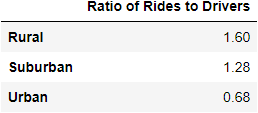

# PaddyHQ-PyBer-Analysis
## Overview of the analysis:
The goal of this report is to analyze data from a rideshare company, group the data by city type (rural, suburban, urban), look for disparities in ride sharing data among city types, and provide recommendations on how to handle discrepancies.
# Results: 

*Fig. 1- Summary of rideshare data grouped by city type*

The aggregated data presented in Figure 1 shows a few clear trends. There are more total rides, total drivers, and total dollars in fares for urban cities by far. Suburban cities lag behind urban cities by a significant margin in all metrics, and rural cities trail suburban cities by a significant amount as well. 

The average fare per ride and per driver also follow the same trend. This shows that in rural areas, rideshare trips are likely much further than in urban or suburban cities.

Rural cities have a much higher average fare per driver as well which supports the idea that drivers in rural areas often drive much further than their suburban or urban counterparts.

*Fig 2- Ratio of total drivers to total rides*

Figure 2 shows that in urban areas, there are more drivers than total rides. This shows that in urban areas, customers will have an abundance of potential drivers and short wait times. This also shows that people in urban areas are excited to drive for our company. In rural areas however, the number of rides is 1.6x higher than the number of drivers. This means that in rural areas there are less drivers to go around.

Something important to note is that this dataset does not include numbers on cancelled drives due to wait times. It is likely that with a ratio of 1.6 rides to every 1 driver, many people in rural areas are subject to long enough wait times that they would cancel their ride request.

*Fig. 3- Total fare grouped by city type for January 2019 to May 2019*

For the months of Jan to May, weekly total for all 3 city types fall within a consistent range of +/-$600 with no real trend up or down between months.

We know that rural cities see consistently less fares, but our data when plotted by week shows that for some weeks rural cities have near $0 in fares. Rideshare fares for rural areas are below $500 a week for all rural cities measured.

## Summary:
### Strengths

Our data for urban and suburban cities looks strong and improvements in technology will further aid our business.

* It should be noted that future expansion of cellular and broadband technology will have a significant positive impact on our business.
  * Satellite provided cellular and broadband technology is on the horizon.
* As we increase our market penetration and brand recognition into urban and suburban areas, rural areas are likely to follow suit.
  
### Challenges
There are many barriers to rideshare penetration into the rural markets.

1. Technological infrastructure in rural areas is a problem.
2. Use of credit cards is a deterrent to those who only use cash.
3. There aren't enough drivers in rural areas to ensure everyone who requests a ride can get one in a timely fashion.
4. In areas where trips are long and parking is abundant, ridesharing is not considered preferable over car ownership.
5. Mapping in rural areas is unreliable.

### Recommendations for Increasing Effectiveness in Rural Areas
  
1. Moving to a call center model for rural areas and encouraging drivers to form relationships with clients would better cater to our market. This might involve adjusting the driver compensation model for these areas.
2. Include a phone number one can call to hail rides for rural areas and allow for a cash payment system. This would lower the barrier to entry for some consumers who operate cash only and aren't technology savvy.
3. strategically penetrate markets with research. find communities that may be more open and have the means.

## Future research/Data Collection

In future, I would recommend ongoing tracking of these data in order to look for trends, especially comparing multiple years. In future, data should be collected on on length of trip, driver and rider satisfaction (star rating), cancelled trips, and tip amounts. This would make future data analyses more robust.