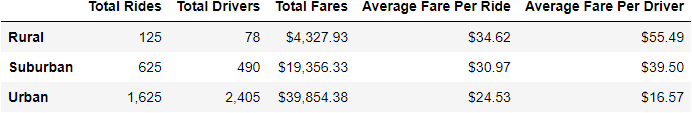
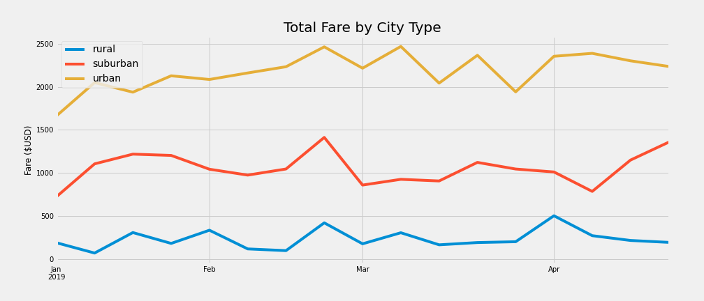

# PaddyHQ-PyBer-Analysis
Module 5- Berkley
## Overview of the analysis:
Finding and addressing disparities in ride sharing data among city types
# Results: 

*Fig. 1- Summary of rideshare data grouped by city type*

More rides in urban cities by far. Many fewer in rural cities. 
More drivers in urban and less in rural
Fares are up.
Fare per ride in rural is much higher- probably means rides are longer- trend is conserved
Fare per driver in rural is much higher- ratio of rides to drivers is higher in rural

*Fig. 2- Total fare grouped by city type for January 2019 to May 2019*

For the months of Jan to May, weekly total for all 3 city types fall within a range of +/- $1000 with no real trend up or down between months. Rideshare sales seem consistent.

Rural consistently less, Urban consistently most. No crossover. Trend in data is reliable.

## Summary: Based on the results, provide three business recommendations to the CEO for addressing any disparities among the city types.

* technological infrastructure is a problem
* expansion of cellular and broadband technology
* use of credit cards is a deterrent to those who only use cash
* ridesharing is most prevalent when rides are short and parking is difficult
* moving to a call center model for rural areas and encouraging drivers to form relationships with clients (caters to a rural audience)
* possibly change compensation model for rural areas to include a flat rate (if it's not possible to make a livelihood, you won't have drivers)
* improve maps for rural areas
* strategically penetrate markets with research. find communities that may be more open and have the means.
* patience. market penetration takes time.

Would like to see a full year and compare multiple years. Would like to have data on length of trip and tip amounts.

There is a statement summarizing three business recommendations to the CEO for addressing any disparities among the city types. (4 pt)